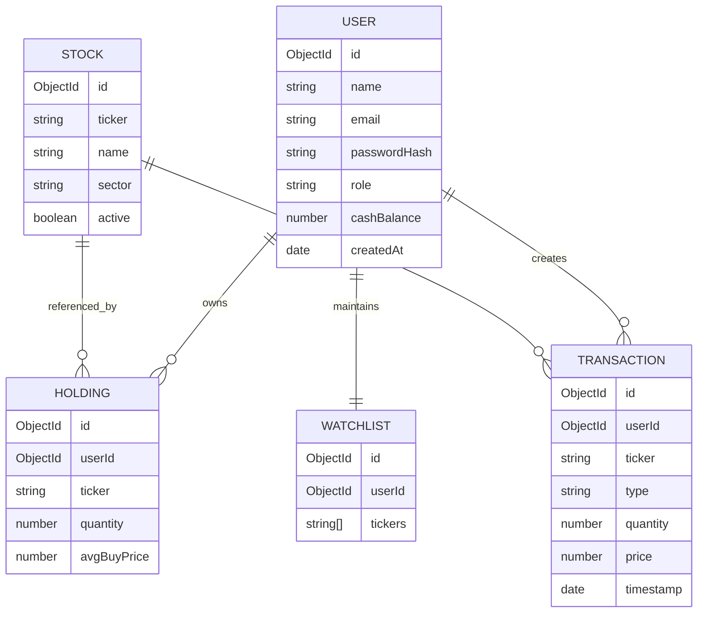
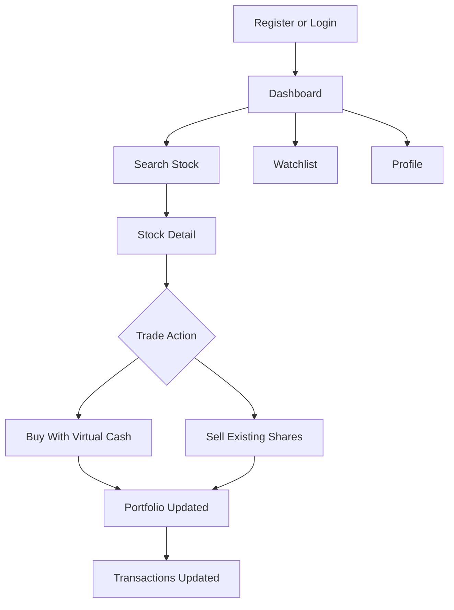

# Project Architecture

Complexity: medium

Duration: 1h 0m

Progress: 100%

Stories: 6

## Completion Summary

- Technical Architecture: 100%
- ER Diagram: 100%
- Features: 100%
- Roles And Responsibilities: 100%
- User Flow: 100%
- MVC Pattern: 100%

## Technical Architecture

Story

- Duration: 10m
- Review: Completed
- Assigned to: UDAY DONIKELA

SB Stocks uses the MERN stack.

- Frontend: React, React Router, Tailwind CSS, Recharts
- Backend: Node.js, Express.js
- Database: MongoDB Atlas with Mongoose
- Authentication: JWT sessions and bcrypt password hashing
- Market data: Finnhub API with cached responses and fallback mock data
- Deployment: Docker service on Render

## ER Diagram

Story

- Duration: 10m
- Review: Completed
- Assigned to: UDAY DONIKELA

## Features

Story

- Duration: 10m
- Review: Completed
- Assigned to: UDAY DONIKELA

- User registration, login, logout, and persisted JWT session
- Protected dashboard with cash balance, holdings, portfolio value, and gain/loss
- Stock search by ticker/name
- Stock detail page with current quote and historical chart
- Buy and sell simulation using virtual funds
- Validation for cash balance, share quantity, and trade inputs
- Transaction history
- Watchlist management
- Admin stock management panel
- Responsive UI for desktop and mobile
- Docker-based Render deployment

## Roles And Responsibilities

Story

- Duration: 10m
- Review: Completed
- Assigned to: UDAY DONIKELA

- User: registers, logs in, searches stocks, buys/sells virtual shares, views holdings, manages watchlist, reviews transactions.
- Admin: manages stock records through protected admin routes and UI.
- Backend: validates requests, protects routes, manages trading rules, connects to MongoDB, calls market data service.
- Frontend: displays pages, handles forms, stores token, calls backend APIs, renders charts and loading/error states.

## User Flow

Story

- Duration: 10m
- Review: Completed
- Assigned to: UDAY DONIKELA

## MVC Pattern

Story

- Duration: 10m
- Review: Completed
- Assigned to: UDAY DONIKELA

- Models: `server/src/models`
- Views/UI: `client/src/pages` and `client/src/components`
- Controllers: `server/src/controllers`
- Routes: `server/src/routes`
- Middleware: `server/src/middleware`
- Services: `server/src/services`
